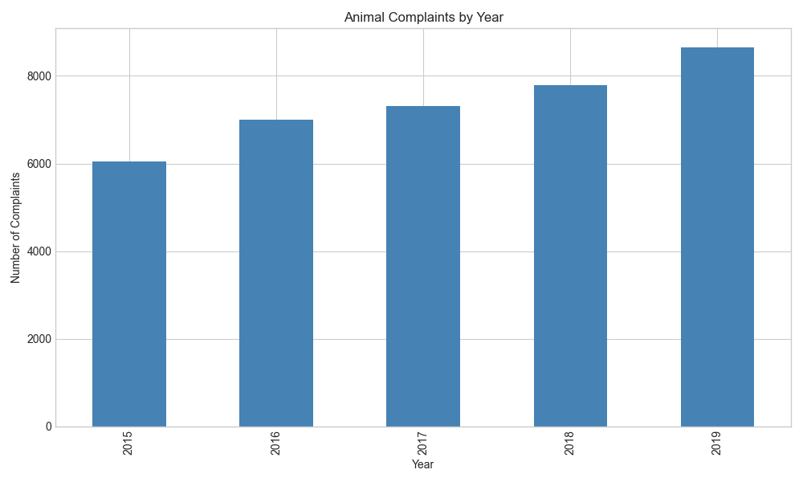
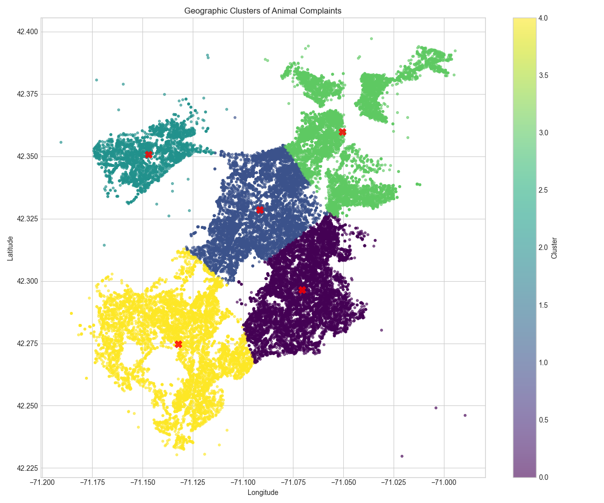
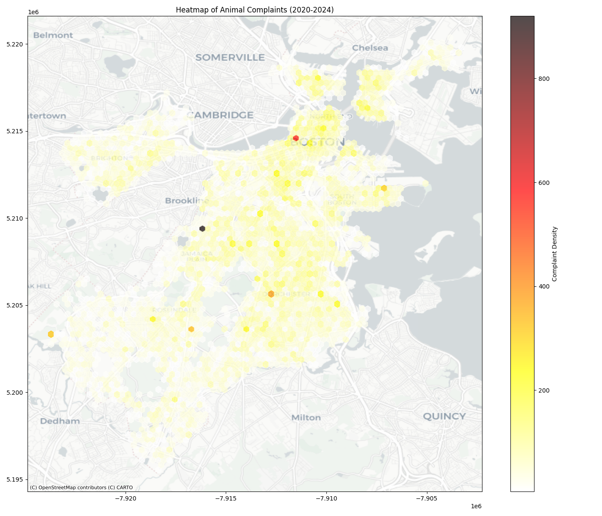
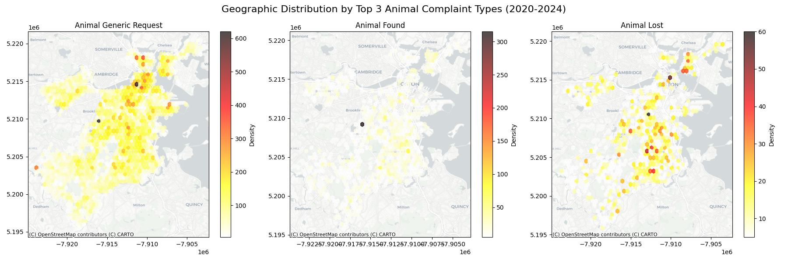
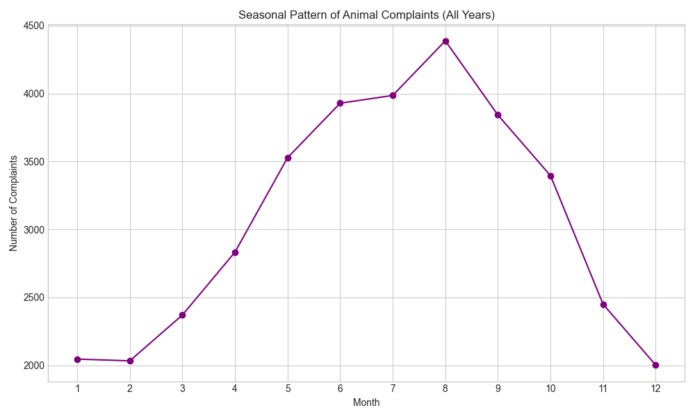

# Boston 311 Animal Complaints Analysis - Midterm Report

## Project Overview

This project analyzes animal-related complaints submitted through Boston's 311 app from 2015-2019. We aim to identify trends in complaint volumes, types of animals involved, geographic patterns, and seasonal variations to provide actionable insights for the Citywide Analytics Team.

## Data Processing

### Data Source and Collection
- We obtained 5 years of Boston's 311 service request data (2015-2019) in CSV format
- Each file contains a full year of complaint data with attributes including timestamps, locations, and descriptions
- Total raw data: 1,199,657 records across all service request types

### Data Cleaning and Preprocessing
1. **Filtering Animal Complaints**:
   - Extracted animal-related complaints using keyword matching in case titles
   - Keywords included: Animal, Dog, Cat, Rat, Wildlife, Bird, etc.
   - Resulted in 36,803 animal-related complaints (approximately 3% of all service requests)

2. **Handling Missing Values**:
   - Removed records with missing geographic coordinates (essential for spatial analysis)
   - Converted date strings to datetime objects for temporal analysis

3. **Feature Engineering**:
   - Created derived time features: year, month, day of week, quarter, and season
   - Classified animal types by analyzing case titles and subject fields
   - Added geographic cluster assignments based on location coordinates

4. **Data Structure**:
   - The cleaned dataset contains all original fields plus the derived features
   - Saved as a processed CSV file (17.8 MB) for further analysis

## Modeling Methods

### Temporal Analysis
- **Time Series Aggregation**: Grouped complaints by year, month, day of week, and season
- **Trend Analysis**: Analyzed year-over-year changes in complaint volumes
- **Seasonal Decomposition**: Identified seasonal patterns in monthly data

### Animal Type Classification
- **Text-based Classification**: Developed a rule-based classifier to categorize complaints by animal type
- **Hierarchical Categorization**: Primary categories include Other Animal, Cat, Rat/Rodent, and more

### Geographic Clustering
- **K-means Clustering**: Applied K-means algorithm to identify geographic hotspots
- **Parameters**:
  - Number of clusters: 5 (chosen based on preliminary testing)
  - Features used: Latitude and longitude coordinates
  - Distance metric: Euclidean distance
  - Standardization: Applied StandardScaler to normalize coordinates
- **Cross-tabulation**: Analyzed animal types within each geographic cluster

### Seasonal Patterns
- **Seasonal Grouping**: Categorized months into four seasons
- **Cross-tabulation**: Analyzed animal types by season
- **Correlation Analysis**: Examined relationships between seasons and complaint volumes

## Preliminary Results

### Temporal Trends
- **Annual Growth**: Animal complaints increased from 6,051 in 2015 to 8,651 in 2019 (43% increase)
- **Monthly Patterns**: Summer months consistently show the highest complaint volumes
- **Day of Week**: Weekdays have more complaints than weekends



### Animal Type Distribution
- **Major Categories**:
  - "Other Animal": 89.7% (33,005 complaints)
  - "Cat": 9.6% (3,522 complaints)
  - "Rat/Rodent": 0.7% (276 complaints)
- The high percentage of "Other Animal" category suggests further refinement is needed


### Geographic Clusters
- **5 Distinct Clusters** identified across Boston's neighborhoods
- **Cluster Characteristics**:
  - Cluster 0: 7,928 complaints (predominantly "Other Animal")
  - Cluster 1: 7,658 complaints (predominantly "Other Animal")
  - Cluster 2: 2,632 complaints (predominantly "Other Animal")
  - Cluster 3: 8,204 complaints (predominantly "Other Animal")
  - Cluster 4: 6,583 complaints (predominantly "Other Animal")



#### Geographic Distribution of Animal Complaints

The heatmap below shows the density of animal complaints across Boston neighborhoods from 2020-2024. Higher concentrations (yellow to red areas) are visible in downtown Boston, with notable hotspots in specific neighborhoods.



#### Complaint Types Analysis

We identified the top three animal complaint categories as:
1. Animal Generic Request
2. Animal Found
3. Animal Lost

The visualization below shows the geographic distribution of these three complaint types, revealing distinct patterns:
- Animal Generic Requests are widespread across the city with higher concentrations in central Boston
- Animal Found reports show a more dispersed pattern with fewer hotspots
- Animal Lost reports are concentrated in residential areas, particularly in southern and eastern neighborhoods



### Seasonal Patterns
- **Summer**: Highest volume with 12,216 complaints (33.2%)
- **Spring**: 9,289 complaints (25.2%)
- **Fall**: 7,039 complaints (19.1%)
- **Winter**: Lowest volume with 5,463 complaints (14.8%)
- All seasons show "Other Animal" as the predominant category



## Key Insights and Next Steps

### Key Insights
1. **Growing Concern**: The 43% increase in animal complaints over 5 years suggests this is a growing issue requiring attention
2. **Seasonal Focus**: Summer requires significantly more resources for animal control
3. **Geographic Targeting**: The 5 identified clusters provide clear targets for intervention
4. **Category Refinement**: The large "Other Animal" category needs further investigation

### Next Steps
1. **Refine Animal Classification**:
   - Develop a more granular classification method using NLP techniques
   - Analyze the "case_title" and "closure_reason" fields for more details

2. **Weather Correlation Analysis**:
   - Obtain weather data for Boston (2015-2019)
   - Analyze correlations between temperature, precipitation, and complaint volumes

3. **Predictive Modeling**:
   - Develop time series forecasting models to predict future complaint volumes
   - Use machine learning to predict geographic hotspots

4. **Advanced Spatial Analysis**:
   - Incorporate neighborhood demographic data
   - Analyze relationships between animal complaints and other factors (population density, income, etc.)

## Project Structure
```
.
├── README.md               # This midterm report
├── notebooks/              # Analysis notebooks
│   └── animal_complaints_analysis.py  # Main analysis script
├── outputs/                # Generated analysis outputs
│   ├── cleaned_animal_complaints.csv  # Cleaned data
│   ├── analysis_report.md  # Comprehensive findings report
│   └── *.png               # Visualizations
└── *.csv                   # Raw data files (2015.csv through 2019.csv)
```

## Project Team
- Biswajit Satapathy
- Anupam Chetia
- Roman Bukhovko
- Pranshu Swaroop
- Syed Adnan
